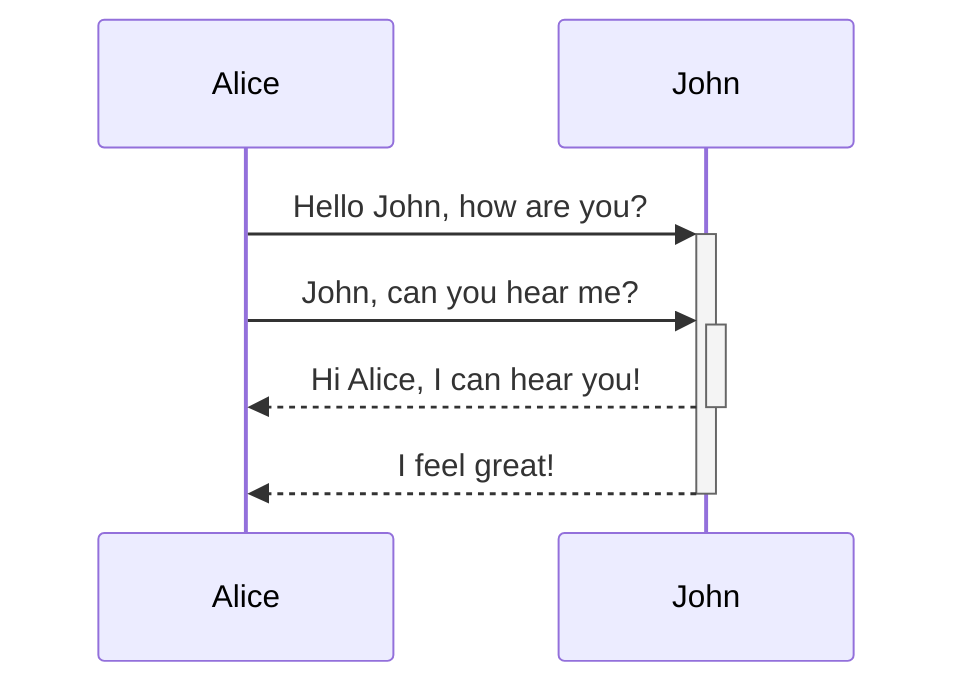
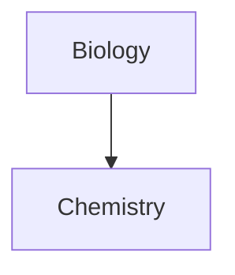

---
cssclasses:
  - cards
  - cards-1-1
  - cards-cols-3
tags:
  - UI-X
  - how-to
  - example
aliases:
  - how-to-ui
---

This information can be found on the [Obsidian site](https://help.obsidian.md/Editing+and+formatting/Basic+formatting+syntax#Styling%20text). 

## Headings

To create a heading, add up to six `#` symbols before your heading text. The number of `#` symbols determines the size of the heading.

```md
# This is a heading 1
## This is a heading 2
### This is a heading 3
#### This is a heading 4
##### This is a heading 5
###### This is a heading 6
```

# This is a heading 1
## This is a heading 2
### This is a heading 3
#### This is a heading 4
##### This is a heading 5
###### This is a heading 6

## Styling text

|Style|Syntax|Example|Output|
|---|---|---|---|
|Bold|`** **` or `__ __`|`**Bold text**`|**Bold text**|
|Italic|`* *` or `_ _`|`*Italic text*`|_Italic text_|
|Strikethrough|`~~ ~~`|`~~Striked out text~~`|~~Striked out text~~|
|Highlight|"double-equal signs"|Highlighted text|==Highlighted text==|
|Bold and nested italic|`** **` and `_ _`|`**Bold text and _nested italic_ text**`|**Bold text and _nested italic_ text**|
|Bold and italic|`*** ***` or `___ ___`|`***Bold and italic text***`|**_Bold and italic text_**|

## Quotes

You can quote text by adding a `>` symbols before the text.

```md
> Human beings face ever more complex and urgent problems, and their effectiveness in dealing with these problems is a matter that is critical to the stability and continued progress of society.

\- Doug Engelbart, 1961
```

> Human beings face ever more complex and urgent problems, and their effectiveness in dealing with these problems is a matter that is critical to the stability and continued progress of society.
> 
> \- Doug Engelbart, 1961

Tip

You can turn your quote into a [callout](##callouts) by adding `[!info]` as the first line in a quote.

## Code

You can format code both inline within a sentence, or in its own block.

### Inline code

You can format code within a sentence using single backticks.

```md
Text inside `backticks` on a line will be formatted like code.
```

Text inside `backticks` on a line will be formatted like code.

If you want to put backticks in an inline code block, surround it with double backticks like so: inline ``code with a backtick ` inside``.

### Code blocks

To format a block of code, surround the code with triple backticks.

````
```
cd ~/Desktop
```
````

```md
cd ~/Desktop
```

You can also create a code block by indenting the text using `Tab` or 4 blank spaces.

```md
    cd ~/Desktop
```

You can add syntax highlighting to a code block, by adding a language code after the first set of backticks.

````md
```js
function fancyAlert(arg) {
  if(arg) {
    $.facebox({div:'#foo'})
  }
}
```
````

```js
function fancyAlert(arg) {
  if(arg) {
    $.facebox({div:'#foo'})
  }
}
```

Obsidian uses Prism for syntax highlighting. For more information, refer to [Supported languages](https://prismjs.com/#supported-languages).

Note

[Live Preview mode](https://help.obsidian.md/Live+preview+update) doesn't support PrismJS and may render syntax highlighting differently.

## External links

If you want to link to an external URL, you can create an inline link by surrounding the link text in brackets (`[ ]`), and then the URL in parentheses (`( )`).

```md
[Obsidian Help](https://help.obsidian.md)
```

[Obsidian Help](https://help.obsidian.md/)

Tip

If you want to link to a file inside your vault, consider using an [internal link](https://help.obsidian.md/Linking+notes+and+files/Internal+links) instead.

You can also create external links to files in other vaults, by linking to an [Obsidian URI](https://help.obsidian.md/Concepts/Obsidian+URI).

```md
[Note](obsidian://open?vault=MainVault&file=Note.md)
```

### Escape blank spaces in links

If your URL contains blank spaces, you need to escape them by replacing them with `%20`.

```md
[My Note](obsidian://open?vault=MainVault&file=My%20Note.md)
```

You can also escape the URL by wrapping it with angled brackets (`< >`).

```md
[My Note](<obsidian://open?vault=MainVault&file=My Note.md>)
```

## External images

You can add images with external URLs, by adding a `!` symbol before an [external link](https://help.obsidian.md/Editing+and+formatting/Basic+formatting+syntax#External%20links).

```md

```


You can change the image dimensions, by adding `|640x480` to the link destination, where 640 is the width and 480 is the height.

```md

```

If you only specify the width, the image scales according to its original aspect ratio. For example, `![[Engelbart.jpg|100]]`.

Tip

If you want to add an image from inside your vault, you can also [embed an image in a note](https://help.obsidian.md/Linking+notes+and+files/Embedding+files#Embed%20an%20image%20in%20a%20note).

## Lists

You can create an unordered list by adding a `-`, `*`, or `+` before the text.

```md
- First list item
- Second list item
- Third list item
```

- First list item
- Second list item
- Third list item

To create an ordered list, start each line with a number followed by a `.` symbol.

```md
1. First list item
2. Second list item
3. Third list item
```

1. First list item
2. Second list item
3. Third list item

You can create a nested list by indenting one or more list items.

```md
1. First list item
   1. Ordered nested list item
2. Second list item
   - Unordered nested list item
```

1. First list item
    1. Ordered nested list item
2. Second list item
    - Unordered nested list item

You can press `Tab` or `Shift+Tab` to indent or unindent one or more selected list items.

### Task lists

To create a task list, start each list item with a hyphen and space followed by `[ ]`.

```md
- [x] This is a completed task.
- [ ] This is an incomplete task.
```

- [x] This is a completed task.
- [ ] This is an incomplete task.

You can toggle a task in Reading view by selecting the checkbox.

Tip

You can use any character inside the brackets to mark it as complete.

```md
- [x] Milk
- [?] Eggs
- [-] Eggs
```

- [x] Milk
- [x] Eggs
- [x] Eggs

## Horizontal bar

You can use three or more stars `***`, hyphens `---`, or underscore `___` on its own line to add a horizontal bar. You can also separate symbols using spaces.

```md
***
****
* * *
---
----
- - -
___
____
_ _ _
```

---

---

## Footnotes

You can add footnotes[[1]](https://publish.obsidian.md/#fn-1-cfc7741af146bc80) to your notes using the following syntax:

```md
This is a simple footnote[^1].

[^1]: This is the referenced text.
[^2]: Add 2 spaces at the start of each new line.
  This lets you write footnotes that span multiple lines.
[^note]: Named footnotes still appear as numbers, but can make it easier to identify and link references.
```

You can also inline footnotes in a sentence. Note that the caret goes outside the brackets.

```md
You can also use inline footnotes. ^[This is an inline footnote.]
```

Note

Inline footnotes only work in reading view, not in Live Preview.

## Comments

You can add comments by wrapping text with `%%`. Comments are only visible in Editing view.

```md
This is an %%inline%% comment.

%%
This is a block comment.

Block comments can span multiple lines.
%%
```

## Tables

You can create table using vertical bars (`|`) and hyphens (`-`). Vertical bars separate columns, and hyphens define the column header.

```md
| First name | Last name |
| ---------- | --------- |
| Max        | Planck    |
| Marie      | Curie     |
```

|First name|Last name|
|---|---|
|Max|Planck|
|Marie|Curie|

The vertical bars or either side of the table are optional.

Cells don't need to be perfectly aligned with the columns. Each header row must have at least two hyphens.

```md
First name | Last name
-- | --
Max | Planck
Marie | Curie
```

### Format content within a table

You can use [basic formatting syntax](https://help.obsidian.md/Editing+and+formatting/Basic+formatting+syntax) to style content within a table.

|First column|Second column|
|---|---|
|[Internal links](https://help.obsidian.md/Linking+notes+and+files/Internal+links)|Link to a file _within_ your **vault**.|
|[Embedding files](https://help.obsidian.md/Linking+notes+and+files/Embedding+files)||

Vertical bars in tables

If you want to use [aliases](https://help.obsidian.md/Linking+notes+and+files/Aliases), or to [resize an image](https://help.obsidian.md/Editing+and+formatting/Basic+formatting+syntax#External%20images) in your table, you need to add a `\` before the vertical bar.

```md
First column | Second column
-- | --
[[Basic formatting syntax\|Markdown syntax]] | ![[og-image.png\|200]]
```

|First column|Second column|
|---|---|
|[Markdown syntax](https://help.obsidian.md/Editing+and+formatting/Basic+formatting+syntax)||

You can align text to the left, right, or center of a column by adding colons (`:`) to the header row.

```md
Left-aligned text | Center-aligned text | Right-aligned text
:-- | :--: | --:
Content | Content | Content
```

|Left-aligned text|Center-aligned text|Right-aligned text|
|:--|:-:|--:|
|Content|Content|Content|

## Diagram

You can add diagrams and charts to your notes, using [Mermaid](https://mermaid-js.github.io/). Mermaid supports a range of diagrams, such as [flow charts](https://mermaid.js.org/syntax/flowchart.html), [sequence diagrams](https://mermaid.js.org/syntax/sequenceDiagram.html), and [timelines](https://mermaid.js.org/syntax/timeline.html).

Tip

You can also try Mermaid's [Live Editor](https://mermaid-js.github.io/mermaid-live-editor) to help you build diagrams before you include them in your notes.

To add a Mermaid diagram, create a `mermaid` [code block](https://help.obsidian.md/Editing+and+formatting/Basic+formatting+syntax#Code%20blocks).

````md

````


````md

````


### Linking files in a diagram

You can create [internal links](https://help.obsidian.md/Linking+notes+and+files/Internal+links) in your diagrams by attaching the `internal-link` [class](https://mermaid.js.org/syntax/flowchart.html#classes) to your nodes.

````md

````

Note

Internal links from diagrams don't show up in the [Graph view](https://help.obsidian.md/Plugins/Graph+view).

If you have many nodes in your diagrams, you can use the following snippet.

````md

````

This way, each letter node becomes an internal link, with the [node text](https://mermaid.js.org/syntax/flowchart.html#a-node-with-text) as the link text.

Note

If you use special characters in your note names, you need to put the note name in double quotes.

```
class "⨳ special character" internal-link
```

Or, `A["⨳ special character"]`.

For more information about creating diagrams, refer to the [official Mermaid docs](https://mermaid.js.org/intro/).

## Math

You can add math expressions to your notes using [MathJax](http://docs.mathjax.org/en/latest/basic/mathjax.html) and the LaTeX notation.

To add a MathJax expression to your note, surround it with double dollar signs (`$$`).

```md
$$
\begin{vmatrix}a & b\\
c & d
\end{vmatrix}=ad-bc
$$
```

You can also inline math expressions by wrapping it in `$` symbols.

```md
This is an inline math expression $e^{2i\pi} = 1$.
```

This is an inline math expression .

For more information about the syntax, refer to [MathJax basic tutorial and quick reference](https://math.meta.stackexchange.com/questions/5020/mathjax-basic-tutorial-and-quick-reference).

For a list of supported MathJax packages, refer to [The TeX/LaTeX Extension List](http://docs.mathjax.org/en/latest/input/tex/extensions/index.html).

Obsidian strives for maximum capability without breaking any existing formats. As a result, we use a combination of flavors of [Markdown](https://help.obsidian.md/Editing+and+formatting/Basic+formatting+syntax).

Obsidian supports [CommonMark](https://commonmark.org/), [GitHub Flavored Markdown](https://github.github.com/gfm/), and [LaTeX](https://www.latex-project.org/). Obsidian does not support using Markdown formatting or blank lines inside of HTML tags.

### Supported Markdown extensions

|Syntax|Description|
|---|---|
|`[[Link]]`|[Internal links](https://help.obsidian.md/Linking+notes+and+files/Internal+links)|
|`![[Link]]`|[Embedding files](https://help.obsidian.md/Linking+notes+and+files/Embedding+files)|
|`![[Link#^id]]`|[Block references](https://help.obsidian.md/Linking+notes+and+files/Internal+links#Link%20to%20a%20block%20in%20a%20note)|
|`^id`|[Defining a block](https://help.obsidian.md/Linking+notes+and+files/Internal+links#Link%20to%20a%20block%20in%20a%20note)|
|`%%Text%%`|[Comments](https://help.obsidian.md/Editing+and+formatting/Basic+formatting+syntax#Comments)|
|`~~Text~~`|[Strikethroughs](https://help.obsidian.md/Editing+and+formatting/Basic+formatting+syntax#Styling%20text)|
|== Text == |[Highlights](https://help.obsidian.md/Editing+and+formatting/Basic+formatting+syntax#Styling%20text)|
|` ``` `|[Code blocks](https://help.obsidian.md/Editing+and+formatting/Basic+formatting+syntax#Code%20blocks)|
|`- [ ]`|[Incomplete task](https://help.obsidian.md/Editing+and+formatting/Basic+formatting+syntax#Task%20lists)|
|`- [x]`|[Completed task](https://help.obsidian.md/Editing+and+formatting/Basic+formatting+syntax#Task%20lists)|
|`> [!note]`|[Callouts](https://help.obsidian.md/Editing+and+formatting/Callouts)|
|`(see link)`|[Tables](https://help.obsidian.md/Editing+and+formatting/Advanced+formatting+syntax#Tables)|

## Callouts

Use callouts to include additional content without breaking the flow of your notes.

To create a callout, add `[!info]` to the first line of a blockquote, where `info` is the _type identifier_. The type identifier determines how the callout looks and feels. To see all available types, refer to [Supported types](https://help.obsidian.md/Editing+and+formatting/Callouts#Supported%20types).

```markdown
> [!info]
> Here's a callout block.
> It supports **Markdown**, [[Internal link|Wikilinks]], and [[Embed files|embeds]]!
> ![[og-image.png]]
```

Info

Here's a callout block.  
It supports **Markdown**, [Wikilinks](https://help.obsidian.md/Linking+notes+and+files/Internal+links) and [embeds](https://help.obsidian.md/Linking+notes+and+files/Embedding+files)!  

Callouts are also supported natively on [Obsidian Publish](https://help.obsidian.md/Obsidian+Publish/Introduction+to+Obsidian+Publish).

Note

If you're also using the Admonitions plugin, you should update it to at least version 8.0.0 to avoid problems with the new callout feature.

### Change the title

By default, the title of the callout is its type identifier in title case. You can change it by adding text after the type identifier:

```markdown
> [!tip] Callouts can have custom titles
> Like this one.
```

> [!tip] Callouts can have custom titles
> Like this one.

You can even omit the body to create title-only callouts:

```markdown
> [!tip] Title-only callout
```

> [!tip] Title-only callout
### Foldable callouts

You can make a callout foldable by adding a plus (+) or a minus (-) directly after the type identifier.

A plus sign expands the callout by default, and a minus sign collapses it instead.

```markdown
> [!faq]- Are callouts foldable?
> Yes! In a foldable callout, the contents are hidden when the callout is collapsed.
```

> [!faq]- Are callouts foldable?
> Yes! In a foldable callout, the contents are hidden when the callout is collapsed.

### Nested callouts

You can nest callouts in multiple levels.

```markdown
> [!question] Can callouts be nested?
> > [!todo] Yes!, they can.
> > > [!example]  You can even use multiple layers of nesting.
```

> [!question] Can callouts be nested?
> > [!todo] Yes!, they can.
> > > [!example]  You can even use multiple layers of nesting.

### Customize callouts

[CSS snippets](https://help.obsidian.md/Extending+Obsidian/CSS+snippets) and [Community plugins](https://help.obsidian.md/Extending+Obsidian/Community+plugins) can define custom callouts, or even overwrite the default configuration.

To define a custom callout, create the following CSS block:

```css
.callout[data-callout="custom-question-type"] {
    --callout-color: 0, 0, 0;
    --callout-icon: lucide-alert-circle;
}
```

The value of the `data-callout` attribute is the type identifier you want to use, for example `[!custom-question-type]`.

- `--callout-color` defines the background color using numbers (0–255) for red, green, and blue.
- `--callout-icon` can be an icon ID from [lucide.dev](https://lucide.dev/), or an SVG element.

SVG icons

Instead of using a Lucide icon, you can also use a SVG element as the callout icon.

```css
--callout-icon: '<svg>...custom svg...</svg>';
```

### Supported types

You can use several callout types and aliases. Each type comes with a different background color and icon.

To use these default styles, replace `info` in the examples with any of these types, such as `[!tip]` or `[!warning]`.

Unless you [Customize callouts](https://help.obsidian.md/Editing+and+formatting/Callouts#Customize%20callouts), any unsupported type defaults to the `note` type. The type identifier is case-insensitive.

Note

> [!note]
> Lorem ipsum dolor sit amet

```md
> [!note]
> Lorem ipsum dolor sit amet
```

---

Abstract

> [!abstract]
> Lorem ipsum dolor sit amet


```md
> [!abstract]
> Lorem ipsum dolor sit amet
```

Aliases: `summary`, `tldr`

---

Info

> [!info]
> Lorem ipsum dolor sit amet


```md
> [!info]
> Lorem ipsum dolor sit amet
```

---

Todo

> [!todo]
> Lorem ipsum dolor sit amet


```md
> [!todo]
> Lorem ipsum dolor sit amet
```

---

Tip

> [!tip]
> Lorem ipsum dolor sit amet


```md
> [!tip]
> Lorem ipsum dolor sit amet
```

Aliases: `hint`, `important`

---

Success

> [!success]
> Lorem ipsum dolor sit amet


```md
> [!success]
> Lorem ipsum dolor sit amet
```

Aliases: `check`, `done`

---

Question

> [!question]
> Lorem ipsum dolor sit amet


```md
> [!question]
> Lorem ipsum dolor sit amet
```

Aliases: `help`, `faq`

---

Warning

> [!warning]
> Lorem ipsum dolor sit amet


```md
> [!warning]
> Lorem ipsum dolor sit amet
```

Aliases: `caution`, `attention`

---

Failure

> [!failure]
> Lorem ipsum dolor sit amet


```md
> [!failure]
> Lorem ipsum dolor sit amet
```

Aliases: `fail`, `missing`

---

Danger

> [!danger]
> Lorem ipsum dolor sit amet


```md
> [!danger]
> Lorem ipsum dolor sit amet
```

Alias: `error`

---

Bug

> [!bug]
> Lorem ipsum dolor sit amet


```md
> [!bug]
> Lorem ipsum dolor sit amet
```

---

Example

> [!example]
> Lorem ipsum dolor sit amet


```md
> [!example]
> Lorem ipsum dolor sit amet
```

---

Quote

> [!quote]
> Lorem ipsum dolor sit amet


```md
> [!quote]
> Lorem ipsum dolor sit amet
```

Alias: `cite`

## Checkboxes

|Syntax|Description|
|---|---|
|`- [ ]`|Unchecked|
|`- [x]`|Checked|
|`- [>]`|Rescheduled|
|`- [<]`|Scheduled|
|`- [!]`|Important|
|`- [-]`|Cancelled|
|`- [/]`|In Progress|
|`- [?]`|Question|
|`- [*]`|Star|
|`- [n]`|Note|
|`- [l]`|Location|
|`- [i]`|Information|
|`- [I]`|Idea|
|`- [S]`|Amount|
|`- [p]`|Pro|
|`- [c]`|Con|
|`- [b]`|Bookmark|
|`- ["]`|Quote|
|`- [0]`|Speech bubble 0|
|`- [1]`|Speech bubble 1|
|`- [2]`|Speech bubble 2|
|`- [3]`|Speech bubble 3|
|`- [4]`|Speech bubble 4|
|`- [5]`|Speech bubble 5|
|`- [6]`|Speech bubble 6|
|`- [7]`|Speech bubble 7|
|`- [8]`|Speech bubble 8|
|`- [9]`|Speech bubble 9|

- [ ] Unchecked
- [x] Checked
- [>] Rescheduled
- [<] Scheduled
- [!] Important
- [-] Cancelled
- [/] In Progress
- [?] Question
- [*] Star
- [n] Note
- [l] Location
- [i] Information
- [I] Idea
- [S] Amount
- [p] Pro
- [c] Con
- [b] Bookmark
- ["] Quote
- [0] Speech bubble 0
- [1] Speech bubble 1
- [2] Speech bubble 2
- [3] Speech bubble 3
- [4] Speech bubble 4
- [5] Speech bubble 5
- [6] Speech bubble 6
- [7] Speech bubble 7
- [8] Speech bubble 8
- [9] Speech bubble 9

## Data View Queries

```dataview
table job-position, email, aliases, workphone
from "90 - People"
```

## Emoji's ???

:cupid:
